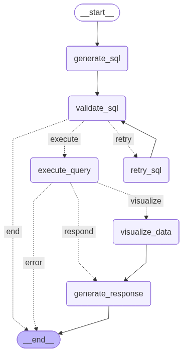

<div align="left">

```diff
+  ╔╦╗╔═╗╔╦╗╔═╗  ╔═╗╔═╗╔═╗╔╗╔╔╦╗
+   ║║╠═╣ ║ ╠═╣  ╠═╣║ ╦║╣ ║║║ ║
+  ═╩╝╩ ╩ ╩ ╩ ╩  ╩ ╩╚═╝╚═╝╝╚╝ ╩

[ Natural Language → SQL Query Agent ]
```

</div>

[](https://www.python.org/downloads/)
[](https://opensource.org/licenses/MIT)


---

A natural language to SQL (NL2SQL) platform built on LangGraph and Azure OpenAI. This multi-agent system automatically routes user questions to the appropriate database backend and generates optimized SQL queries and results.

Built on top of LangChain's [`SQLDatabase`](https://docs.langchain.com/oss/python/langchain/sql-agent) with extended support for Azure AD authentication, Cosmos DB, and built-in dialect validation.

## Features

- **Multi-Database Support**: PostgreSQL, Azure SQL, Azure Synapse, Azure Cosmos DB, Databricks SQL, and Google BigQuery
- **Intent Detection**: Automatically routes queries to the correct data agent based on question context
- **Multi-Turn Conversations**: Follow-up questions with context awareness (e.g., "What's the average?" after a query)
- **SQL Validation**: Safe query execution with sqlglot-based validation across all dialects
- **Data Visualization**: Generate charts and graphs from query results using natural language (e.g., "show me a bar chart")
- **Configurable Agents**: YAML-based configuration for adding new data sources
- **A2A Protocol**: Agent-to-Agent interoperability for integration with other A2A-compliant systems

## Architecture

### Intent Detection Flow

Routes user questions to the appropriate data agent based on context.


### Data Agent Flow

Generates, validates, and executes SQL queries with retry logic.



## Documentation

- [Database Setup](docs/DATABASE_SETUP.md)
- [Configuration](docs/CONFIGURATION.md)
- [Data Visualization](docs/VISUALIZATION.md)
- [A2A Protocol](docs/A2A.md)

## Quick Start

### Prerequisites

- Python 3.12+
- [uv](https://docs.astral.sh/uv/) package manager
- Azure OpenAI deployment

### Installation

```bash
git clone https://github.com/eosho/langchain_data_agent
cd langchain_data_agent
uv sync --all-extras
cp .env.example .env
# Edit .env with your values
```

### CLI Usage

The CLI provides commands for querying data agents through natural language.

```bash
# Show available commands
data-agent --help
```

**Commands:**

| Command | Description |
|---------|-------------|
| `query` | Run a single query and exit |
| `chat` | Start interactive chat mode |
| `configs` | List available configurations |
| `validate` | Validate configuration files |

**Options:**

| Option | Description |
|--------|-------------|
| `-c, --config` | Configuration to use (default: loads all configs) |
| `-v/-q, --verbose/--quiet` | Show/hide query state (agent, SQL, message history) |
| `-l, --log-level` | Logging level (debug, info, warning, error) |

Each config file contains multiple specialized data agents. The system automatically routes your question to the appropriate agent.

| Config | Agents | Domain |
|--------|--------|--------|
| `contoso` | `contoso_sales`, `contoso_products`, `contoso_inventory` | Retail data (Databricks, Cosmos DB, PostgreSQL) |
| `adventure_works` | `contoso_hr`, `hotel_analytics` | HR & hotel data (Azure SQL, Synapse) |
| `amex` | `financial_transactions` | Financial data (BigQuery) |

**Example Questions by Config:**

<details>
<summary><b>contoso</b> (default)</summary>

**contoso_sales** (Databricks)
1. How many orders were placed last month?
2. What is the total revenue by region?

**contoso_products** (Cosmos DB)
1. How many active products are there?
2. Find all products with low inventory
3. What is the most expensive product?

**contoso_inventory** (PostgreSQL)
1. Which products need to be reordered?
2. What is the total inventory by warehouse?
3. How many shipments are in transit?

```bash
# Single query (loads all configs by default)
data-agent query "How many shipments are in transit?"

# Interactive chat
data-agent chat

# Use specific config
data-agent query "How many shipments are in transit?" -c contoso
data-agent chat -c contoso
```

</details>

<details>
<summary><b>adventure_works</b></summary>

**contoso_hr** (Azure SQL)
1. How many employees are in each department?
2. What is the average salary by department?
3. Who are the top performers this year?

**hotel_analytics** (Synapse)
1. What is the total revenue by hotel?
2. What is the revenue breakdown by booking channel?
3. What is the average daily rate by room type?

```bash
data-agent query "What is the total revenue by hotel?" -c adventure_works
data-agent chat -c adventure_works
```

</details>

<details>
<summary><b>amex</b></summary>

**financial_transactions** (BigQuery)
1. What are the total deposits by customer segment?
2. Show me all high-severity fraud alerts from the past week
3. Who are the top 5 customers by transaction volume?
4. Show me a bar chart of transactions by type

```bash
data-agent query "What are the total deposits by customer segment?" -c amex
data-agent chat -c amex
```

</details>

```bash
# List available configs
data-agent configs

# Validate configuration files
data-agent validate           # Validate all configs
data-agent validate contoso   # Validate specific config
```

### Chainlit Web UI

The platform includes a Chainlit-based web interface for interactive data exploration.

```bash
# Start the Chainlit UI
chainlit run src/data_agent/ui/app.py
```

**Available Profiles:**

| Profile | Description |
|---------|-------------|
| Contoso | Retail sales database with products, customers, and orders |
| Amex | Financial transactions and merchant data |
| Adventure Works | Sample database with sales and product information |

**Environment Variables:**

Ensure these are set in your `.env` file:

```bash
AZURE_OPENAI_ENDPOINT=https://your-resource.openai.azure.com/
AZURE_OPENAI_API_KEY=your-api-key
AZURE_OPENAI_DEPLOYMENT=gpt-4o
```

### Programmatic Usage

```python
import asyncio
from data_agent import DataAgentFlow

async def main():
    async with DataAgentFlow(
        config_path="data_agent/config/contoso.yaml",
        azure_endpoint="https://your-resource.openai.azure.com/",
        api_key="your-api-key",
        deployment_name="gpt-4o",
    ) as flow:
        result = await flow.query("Show me all warehouses")
        print(result["final_response"])

asyncio.run(main())
```

## Supported Databases

The platform includes built-in configuration for these databases:

| Database | Datasource Type | SQL Dialect |
|----------|-----------------|-------------|
| PostgreSQL | `postgres` | postgres |
| Azure SQL | `azure_sql` | tsql |
| Azure Synapse | `synapse` | tsql |
| Azure Cosmos DB | `cosmos` | cosmosdb |
| Databricks SQL | `databricks` | databricks |
| Google BigQuery | `bigquery` | bigquery |
| MySQL | `mysql` | mysql |
| SQLite | `sqlite` | sqlite |

> **Note:** Any SQLAlchemy-compatible database can be used via `shared_db` parameter or `connection_string` in config. The built-in types provide convenience configuration and AAD authentication support.

## Development

```bash
# Format and lint
uv run pre-commit run --all-files

# Run tests
uv run pytest
```

## License

MIT License - see LICENSE file for details.
