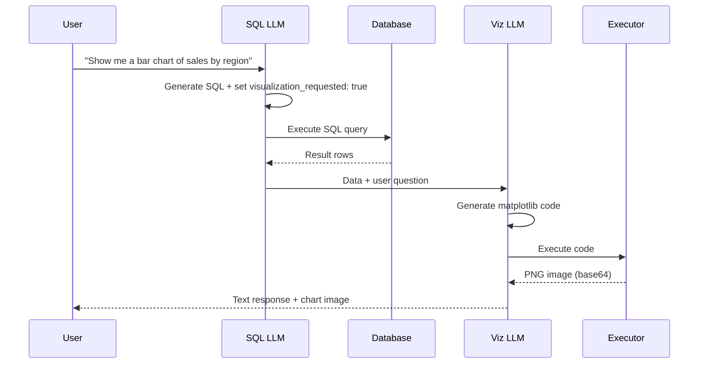

# Data Visualization

This guide covers the code interpreter feature for generating charts and visualizations from query results.

## Overview

When enabled, the data agent can detect visualization intent in user queries (e.g., "show me a chart", "plot the data") and generate matplotlib code to create charts. The code runs in a secure, isolated environment using Azure Container Apps Dynamic Sessions.

**Key features:**
- Automatic detection of visualization requests
- LLM-generated matplotlib code
- Secure sandboxed execution with Hyper-V isolation
- Native image capture (no file storage)
- Support for bar charts, line charts, pie charts, scatter plots, and more

## Requirements

Visualization requires Azure Container Apps Dynamic Sessions. This provides:

| Feature | Benefit |
|---------|---------|
| **Hyper-V isolation** | Each execution runs in a dedicated VM |
| **Pre-installed packages** | NumPy, Pandas, Matplotlib ready to use |
| **Native image capture** | `plt.show()` output captured automatically |
| **Automatic cleanup** | Sessions terminate after idle timeout |
| **No host access** | Code cannot access host filesystem or network |

## Azure Setup

Follow the [Azure Container Apps Dynamic Sessions with LangChain tutorial](https://learn.microsoft.com/en-us/azure/container-apps/sessions-tutorial-langchain) to:

1. Create a Container Apps session pool
2. Get the pool management endpoint
3. Assign the `Azure ContainerApps Session Executor` role to your identity

Once complete, you'll have an endpoint URL like:
```
https://eastus.dynamicsessions.io/subscriptions/<sub>/resourceGroups/<rg>/sessionPools/<pool>
```

## Configuration

### Environment Variable

Set the pool endpoint:

```bash
export AZURE_SESSIONS_POOL_ENDPOINT="https://eastus.dynamicsessions.io/subscriptions/.../sessionPools/..."
```

Or in `.env`:
```bash
AZURE_SESSIONS_POOL_ENDPOINT=https://eastus.dynamicsessions.io/subscriptions/.../sessionPools/...
```

### Executor Selection

The system automatically selects the executor based on environment:

| `AZURE_SESSIONS_POOL_ENDPOINT` | Executor | Use Case |
|-------------------------------|----------|----------|
| Set | Azure Sessions | Production (secure, Hyper-V isolation) |
| Not set | Local Python REPL | Development (fast, no sandboxing) |

**No YAML configuration needed** - visualization is always enabled, with the executor determined by environment.

### System Prompt

To enable visualization detection, include `visualization_requested` in your response format:

```yaml
system_prompt: |
  You are a SQL expert for the sales database.

  {schema_context}

  ## Response Format

  Provide your response as JSON with these fields:
  - "thinking": Step-by-step reasoning about the query
  - "sql_query": The generated SQL query
  - "explanation": Brief explanation of what the query does
  - "visualization_requested": Set to true if the user asks for a chart, graph, plot, or visualization
```

## How It Works



### Execution Flow

1. **Intent Detection**: The SQL LLM sets `visualization_requested: true` when it detects chart/graph/plot intent
2. **SQL Execution**: Query runs against the database, returning structured data
3. **Code Generation**: A second LLM call generates matplotlib code tailored to the data and question
4. **Sandboxed Execution**: Code runs in Azure Sessions with automatic image capture
5. **Response Assembly**: Text response and chart image are combined for display

## Example Queries

These prompts trigger visualization:

| Query | Chart Type |
|-------|------------|
| "Show me a bar chart of sales by region" | Bar chart |
| "Visualize the top 10 customers by revenue" | Horizontal bar |
| "Plot monthly revenue trends for 2024" | Line chart |
| "Create a pie chart of transaction types" | Pie chart |
| "Graph the distribution of order values" | Histogram |
| "Compare Q1 vs Q2 performance" | Grouped bar |
